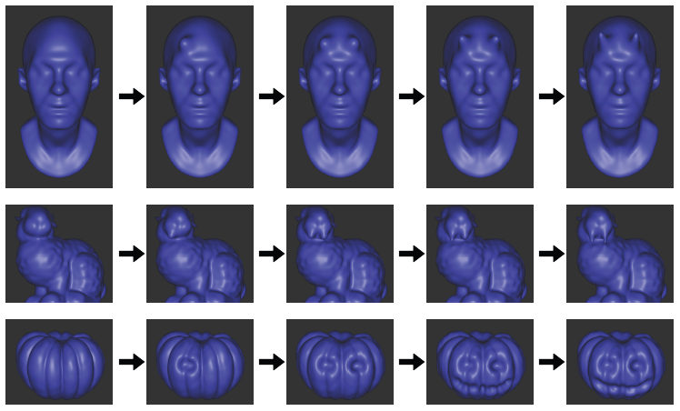

---
youtubeId:
---

 
## 
3D Neural Sculpting (3DNS): Editing Neural Signed Distance Functions

#### 
Petros Tzathas1, Petros Maragos1, Anastasios Roussos2,3

 

1School of Electrical & Computer Engineering, National Technical University of Athens, Greece 
2Institute of Computer Science (ICS), Foundation for Research & Technology - Hellas (FORTH), Greece 
3College of Engineering, Mathematics and Physical Sciences, University of Exeter, UK 

 

 
<a href="https://github.com/pettza/3DNS">Code</a>

 
<blockquote>

In recent years, implicit surface representations through neural networks that encode the signed distance have gained popularity and have achieved state-of-the-art results in various tasks (e.g. shape representation, shape reconstruction, and learning shape priors). However, in contrast to conventional shape representations such as polygon meshes, the implicit representations cannot be easily edited and existing works that attempt to address this problem are extremely limited. In this work, we propose the first method for efficient interactive editing of signed distance functions expressed through neural networks, allowing free-form editing. Inspired by 3D sculpting software for meshes, we use a brush-based framework that is intuitive and can in the future be used by sculptors and digital artists. In order to localize the desired surface deformations, we regulate the network by using a copy of it to sample the previously expressed surface. We introduce a novel framework for simulating sculpting-style surface edits, in conjunction with interactive surface sampling and efficient adaptation of network weights. We qualitatively and quantitatively evaluate our method in various different 3D objects and under many different edits. The reported results clearly show that our method yields high accuracy, in terms of achieving the desired edits, while at the same time preserving the geometry outside the interaction areas.

</blockquote>